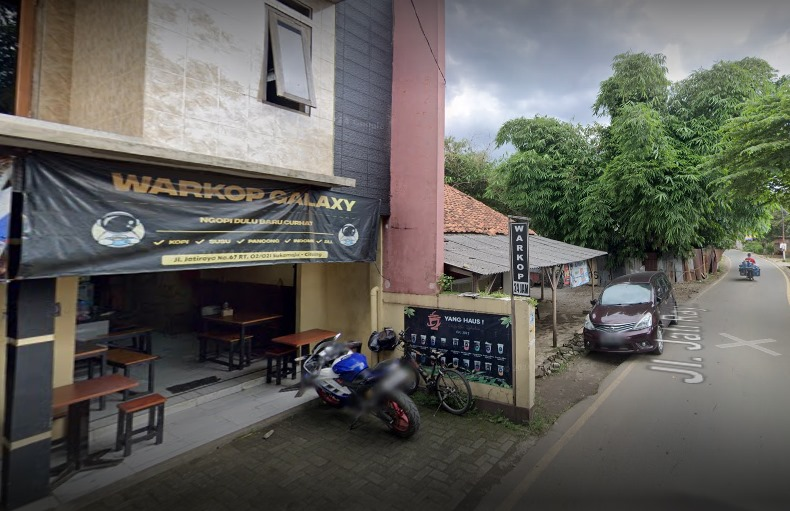
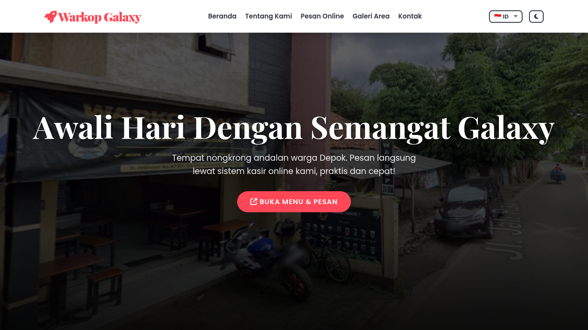
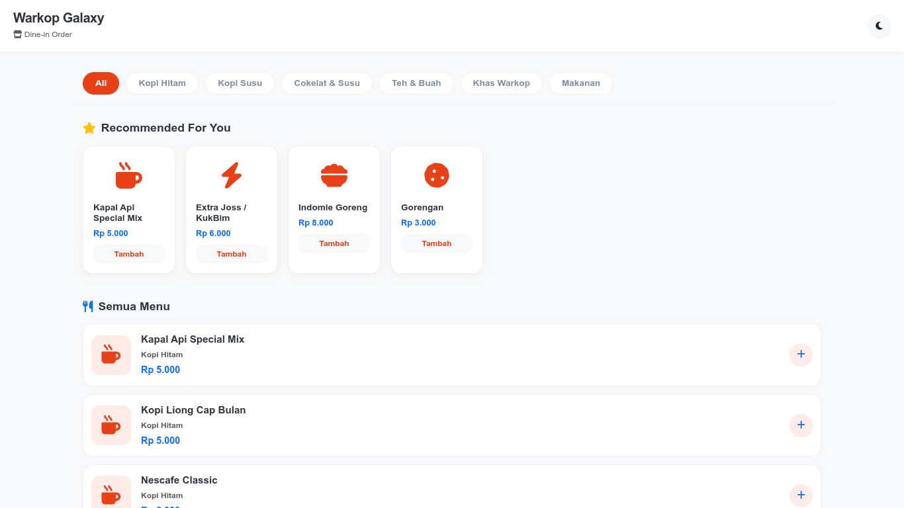

<p align="center">
  
</p>

# ☕ Warkop Galaxy Landing Page

A modern, responsive, and mobile-friendly landing page built for **Warkop Galaxy**, a local coffee shop and community space located in Depok, Indonesia.

Designed to provide customers with an engaging digital experience, this website showcases the brand identity, menu highlights, location information, and promotional content in a clean and visually appealing interface.

---

## 📸 Preview

### Landing Page Preview



### System & Website Overview



---

## ✨ Features

### 🎨 Modern User Interface

Clean and responsive design optimized for desktop, tablet, and mobile devices.

### ⚡ Fast Performance

Built with lightweight frontend technologies to ensure quick loading times and smooth navigation.

### 📱 Mobile Friendly

Responsive layouts adapt seamlessly across different screen sizes.

### 📍 Business Information

Display essential information including:

* About Warkop Galaxy
* Opening Hours
* Contact Information
* Location & Maps
* Social Media Links

### ☕ Menu Showcase

Present featured drinks, foods, and special promotions with attractive visual layouts.

### 🌙 Modern Experience

Includes smooth animations, interactive sections, and contemporary UI elements to improve visitor engagement.

### 🔍 SEO Friendly Structure

Semantic HTML structure designed to improve discoverability on search engines.

---

## 🛠️ Technology Stack

This project is built using modern frontend technologies:

* HTML5
* CSS3
* JavaScript (ES6+)
* Bootstrap 5
* Font Awesome 6
* AOS (Animate On Scroll)
* SweetAlert2

---

## 📂 Project Structure

```text
.
├── index.html
├── preview.png
├── sistem.png
├── assets/
│   ├── css/
│   ├── js/
│   ├── img/
│   └── icons/
└── README.md
```

---

## 🚀 Getting Started

### Clone Repository

```bash
git clone https://github.com/itsmebroarif/pos-warkop.git
```

### Open Project

Simply open:

```text
index.html
```

using your favorite browser.

No installation, build tools, or backend server required.

---

## 🎯 Purpose

This project was created to help local businesses and UMKM establish a stronger digital presence through a modern and accessible website.

The landing page serves as:

* Digital storefront
* Brand introduction
* Online menu showcase
* Customer information hub
* Marketing and promotional platform

---

## 📱 Responsive Design

Tested for common resolutions including:

| Device  | Resolution  |
| ------- | ----------- |
| Mobile  | 360 × 800   |
| Tablet  | 768 × 1024  |
| Laptop  | 1366 × 768  |
| Desktop | 1920 × 1080 |

---

## 📄 License

This project is open-source and available for educational, personal, and commercial customization.

---

## 👨‍💻 Author

**Arif Permana Putrasuryana**

Fullstack Web Developer

🌐 Portfolio: https://arifpermana.vercel.app/

Built with ☕, creativity, and lots of late-night coding sessions.
